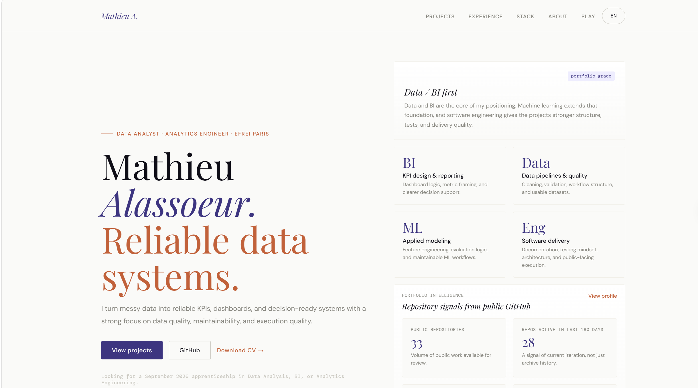

# Portfolio — Mathieu Alassoeur


**Live:** [final-portfolio-eosin-seven.vercel.app](https://final-portfolio-eosin-seven.vercel.app/)

---



---

## What this is

A personal portfolio for data, BI, and analytics engineering projects — built with vanilla JavaScript, no framework, no magic. The goal was not to make the simplest possible site but to treat a static portfolio as a real engineering deliverable: modular architecture, testable logic, a proper CI pipeline, and a production build.

The result is a bilingual (EN/FR) single-page application with live GitHub stats, a project modal system, an embedded playable demo, and fully minified/hashed output via Vite.

## Architecture

The codebase is organized around a strict separation of concerns. Content data lives in `src/js/data/content/` as plain JS objects — one file per section, one object per language. Rendering is handled by `src/js/render/`, which consumes that data and produces DOM nodes without ever touching `innerHTML` for user-controlled strings. Features (navigation, modal, GitHub snapshot, cursor, playable demo) are isolated in `src/js/features/` and imported individually. Utilities (HTML escaping, GitHub date helpers, path resolution) live in `src/js/utils/`.

This separation matters because it makes every layer independently testable. The validation layer in `src/js/validation/content.js` runs a structural check over all project translations at test time — if a required field is missing or a language is out of sync, CI fails.

## Tech stack

HTML5, CSS3, vanilla JavaScript (ES Modules), Vite (build + dev server), ESLint, Prettier, GitHub Actions.

## Getting started

```bash
git clone https://github.com/MatALass/portfolio.git
cd portfolio
npm install
```

Development server (with HMR):

```bash
npm run dev
```

Production build:

```bash
npm run build   # output → dist/
npm run preview # preview the dist/ output locally
```

Quality checks (tests + lint + format):

```bash
npm run check
```

## Configuration

All runtime settings are centralized in `src/js/data/config.js`:

```js
export const SITE_CONFIG = {
  githubUsername: 'MatALass',
  playableDemoUrl: 'https://matalass.github.io/morpion-ultime/',
  cvFilePath: './assets/docs/mathieu-alassoeur-cv.pdf',
  enableCustomCursor: false, // set true to enable the custom cursor
  flagshipRepo: 'github-portfolio-auditor',
  flagshipMeta:
    'Python · Streamlit · GitHub API · policy-driven scoring · tests',
};
```

## CI pipeline

Two jobs run on every push and pull request. The `quality` job runs tests, ESLint, and Prettier checks. The `build` job runs only after `quality` passes and verifies that `vite build` produces a valid `dist/index.html`. If the HTML is broken or an import fails, CI catches it.

## Author

Mathieu Alassoeur — Data Analyst / Analytics Engineer  
[LinkedIn](https://linkedin.com/in/mathieu-alassoeur) · [GitHub](https://github.com/MatALass)

## License

MIT
